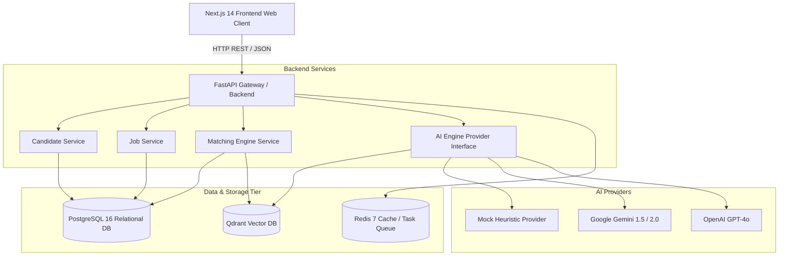

# 🏛️ TalentOS System Design & Architecture

> High-level architecture, module breakdown, and data flow pipelines for TalentOS.

---

## 1. High-Level Architecture

---

## 2. Core Service Modules

### A. Candidate Ingestion & Resume Parsing Pipeline
1. **Upload**: Recruiter or candidate uploads a resume file (`.pdf`, `.docx`, or plain text).
2. **Extraction**: `AI Engine Provider` extracts raw text and executes structured entity recognition.
3. **Pydantic Validation**: Extracted fields (name, email, skills, experience history, education) are validated against `ParsedResumeSchema`.
4. **Relational Save**: Stored into `candidates` and `resumes` PostgreSQL tables.
5. **Vector Ingestion**: Resume summary text is embedded into a dense vector and inserted into the `candidate_resumes` collection in Qdrant.

### B. Hybrid Candidate Matching Engine
When evaluating a candidate against a job opening:
- **Skill Overlap (50%)**: Computes the set intersection between candidate skills and job requirements.
- **Experience Alignment (30%)**: Compares verified experience years with minimum job requirements.
- **Semantic Vector Distance (20%)**: Computes cosine similarity between job embedding and resume embedding via Qdrant.
- **Critique & Gap Analysis**: Highlights missing must-have skills, nice-to-have matches, and generates an AI summary.

---

## 3. Pluggable AI Architecture

TalentOS uses the **Strategy Pattern** for AI capabilities via `BaseAIProvider`:
- **Development / Offline**: `MockAIProvider` uses zero-dependency regex and deterministic vectors, enabling instant local startup without cloud API keys.
- **Production / Scaled**: `GeminiAIProvider` uses Gemini's multimodal and structured JSON output capabilities.
