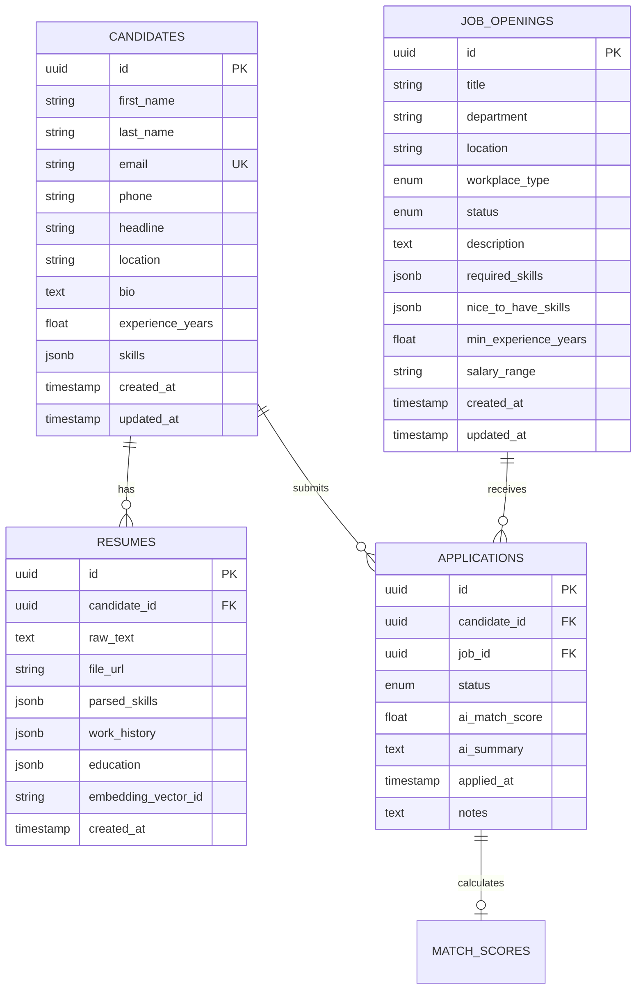

# 🗄️ TalentOS Database Schema Design

This document details the PostgreSQL relational schema and Qdrant vector database definitions for the TalentOS platform.

---

## 📊 Relational Database (PostgreSQL 16)



---

### Table: `candidates`
Stores profile information for registered job seekers and parsed candidates.

| Column | Type | Constraints | Description |
| :--- | :--- | :--- | :--- |
| `id` | `UUID` | `PRIMARY KEY, DEFAULT gen_random_uuid()` | Unique identifier |
| `first_name` | `VARCHAR(100)` | `NOT NULL` | Candidate's given name |
| `last_name` | `VARCHAR(100)` | `NOT NULL` | Candidate's family name |
| `email` | `VARCHAR(255)` | `UNIQUE, NOT NULL, INDEXED` | Candidate contact email |
| `phone` | `VARCHAR(50)` | `NULLABLE` | Contact phone number |
| `headline` | `VARCHAR(255)` | `NULLABLE` | Professional title (e.g. Senior Backend Dev) |
| `location` | `VARCHAR(150)` | `NULLABLE` | City, Country |
| `bio` | `TEXT` | `NULLABLE` | Summary statement |
| `experience_years` | `FLOAT` | `DEFAULT 0.0` | Total verified experience years |
| `skills` | `JSONB` | `DEFAULT '[]'` | Array of canonical skill names |
| `created_at` | `TIMESTAMPTZ` | `DEFAULT NOW()` | Record creation timestamp |
| `updated_at` | `TIMESTAMPTZ` | `DEFAULT NOW()` | Record last update timestamp |

---

### Table: `resumes`
Stores raw and AI-parsed resume data attached to candidate profiles.

| Column | Type | Constraints | Description |
| :--- | :--- | :--- | :--- |
| `id` | `UUID` | `PRIMARY KEY, DEFAULT gen_random_uuid()` | Unique identifier |
| `candidate_id` | `UUID` | `NOT NULL, REFERENCES candidates(id) ON DELETE CASCADE` | Associated candidate |
| `raw_text` | `TEXT` | `NULLABLE` | Extracted plain text from PDF/DOCX |
| `file_url` | `VARCHAR(500)` | `NULLABLE` | S3 or local path to uploaded resume file |
| `parsed_skills` | `JSONB` | `DEFAULT '[]'` | AI-extracted skills array |
| `work_history` | `JSONB` | `DEFAULT '[]'` | Array of `{ company, role, start_date, end_date, summary }` |
| `education` | `JSONB` | `DEFAULT '[]'` | Array of `{ institution, degree, field, graduation_year }` |
| `embedding_vector_id`| `VARCHAR(100)`| `NULLABLE` | Qdrant point reference ID |
| `created_at` | `TIMESTAMPTZ` | `DEFAULT NOW()` | Resume upload timestamp |

---

### Table: `job_openings`
Stores job postings and hiring requisitions.

| Column | Type | Constraints | Description |
| :--- | :--- | :--- | :--- |
| `id` | `UUID` | `PRIMARY KEY, DEFAULT gen_random_uuid()` | Unique identifier |
| `title` | `VARCHAR(200)` | `NOT NULL` | Job role title |
| `department` | `VARCHAR(100)` | `NOT NULL` | Department (Engineering, Product, etc.) |
| `location` | `VARCHAR(150)` | `NOT NULL` | Location (e.g. San Francisco, CA or Global) |
| `workplace_type` | `VARCHAR(20)` | `DEFAULT 'REMOTE'` | `REMOTE`, `HYBRID`, or `ONSITE` |
| `status` | `VARCHAR(20)` | `DEFAULT 'ACTIVE'` | `DRAFT`, `ACTIVE`, or `CLOSED` |
| `description` | `TEXT` | `NOT NULL` | Full job description |
| `required_skills` | `JSONB` | `DEFAULT '[]'` | Mandatory skill requirements |
| `nice_to_have_skills`| `JSONB` | `DEFAULT '[]'` | Preferred skill requirements |
| `min_experience_years`| `FLOAT`| `DEFAULT 0.0` | Minimum years of experience expected |
| `salary_range` | `VARCHAR(100)` | `NULLABLE` | Compensation band (e.g. "$130k - $160k") |
| `created_at` | `TIMESTAMPTZ` | `DEFAULT NOW()` | Creation timestamp |
| `updated_at` | `TIMESTAMPTZ` | `DEFAULT NOW()` | Last update timestamp |

---

### Table: `applications`
Tracks candidate applications to specific job openings.

| Column | Type | Constraints | Description |
| :--- | :--- | :--- | :--- |
| `id` | `UUID` | `PRIMARY KEY, DEFAULT gen_random_uuid()` | Unique identifier |
| `candidate_id` | `UUID` | `NOT NULL, REFERENCES candidates(id) ON DELETE CASCADE` | Applying candidate |
| `job_id` | `UUID` | `NOT NULL, REFERENCES job_openings(id) ON DELETE CASCADE`| Targeted job opening |
| `status` | `VARCHAR(30)` | `DEFAULT 'APPLIED'` | Stage: `APPLIED`, `SCREENING`, `INTERVIEW`, `OFFER`, `HIRED`, `REJECTED` |
| `ai_match_score` | `FLOAT` | `NULLABLE` | Computed fit score (0.0 to 100.0) |
| `ai_summary` | `TEXT` | `NULLABLE` | Executive summary of fit and gaps |
| `applied_at` | `TIMESTAMPTZ` | `DEFAULT NOW()` | Application submission timestamp |
| `notes` | `TEXT` | `NULLABLE` | Internal recruiter notes |

---

## 🧠 Vector Database (Qdrant)

### Collection: `candidate_resumes`
- **Vector Size**: 384 (or 768 for OpenAI/Gemini embeddings)
- **Distance Metric**: `Cosine`
- **Payload Schema**:
  ```json
  {
    "candidate_id": "uuid-string",
    "headline": "Senior Full-Stack Engineer",
    "skills": ["Python", "FastAPI", "React", "PostgreSQL"],
    "experience_years": 5.5
  }
  ```

### Collection: `job_descriptions`
- **Vector Size**: 384 (or 768)
- **Distance Metric**: `Cosine`
- **Payload Schema**:
  ```json
  {
    "job_id": "uuid-string",
    "title": "Senior Backend Engineer",
    "required_skills": ["Python", "PostgreSQL", "Docker"]
  }
  ```
